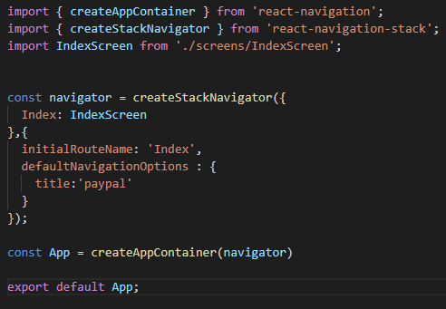
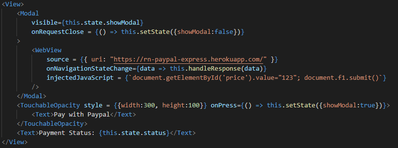
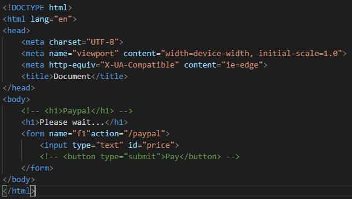
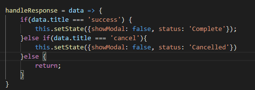
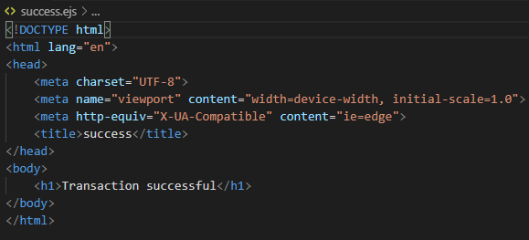
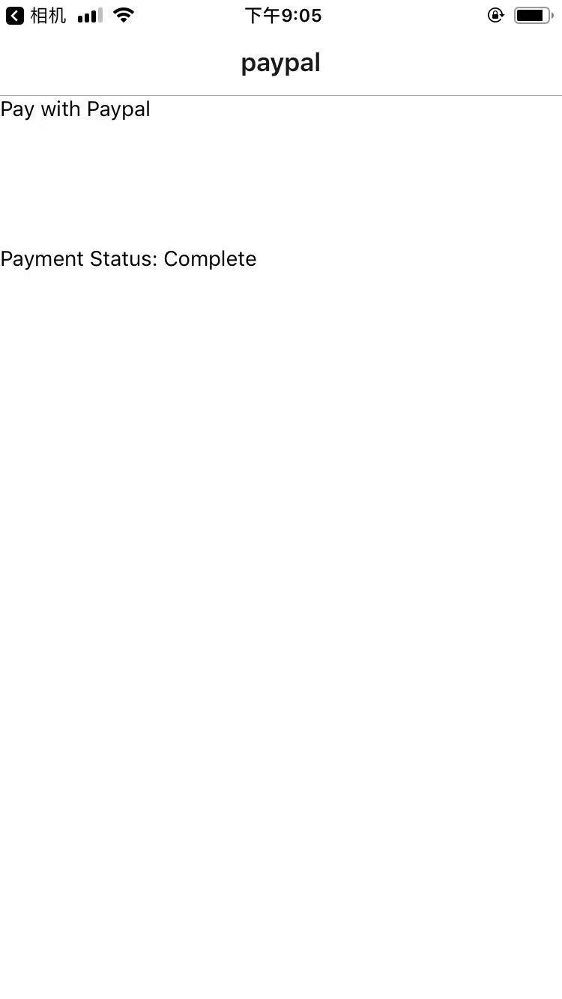

# React-native-paypal
1. in app.js file, we initialized a navigator and put indexScreen as the initial page to show to the user.

2. inside the screen folder we create indexScreen file,  in this file, we use showModal state to control open/close the Modal, when the showModal in state changed to false, the Modal tag below will close. 
3. To show this Modal, we create an touchable opacity, and give it an onpress functions to change the showModal state to true every time the user click on it
4. as we have already created paypal-express file, which u can find details on https://github.com/simonessliu/React-native-paypal-express, 
so here we use webview tag to make a connection. the uri in the source has been changed from localhost to heroku 

5. in the paypal-express indexScreen file we have a form, we can create a button to summit the form or in a more user friendly way, in this indexScreen file we can use injectedJavaScript to point to that form and said like everytime we are on this page we want this form automatically submitted. 

6. at last after the transaction is over, I want the modal to turn off and change the status from pending to complete we add a handle response function above and first we need to see wether that page lead us to success or cancel.
by saying data.title === 'success' or 'cancel'

7. and this is the reason why in paypal express, for each ejs files in views folder, we need to keep the title tag exactly success or cancel .

8. after the transaction is completed, if success it will redirect to the index page and under the payment status we can see it has changed to complete

